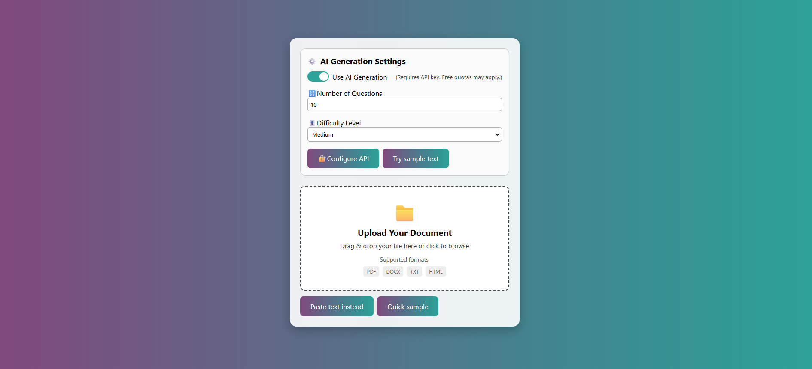
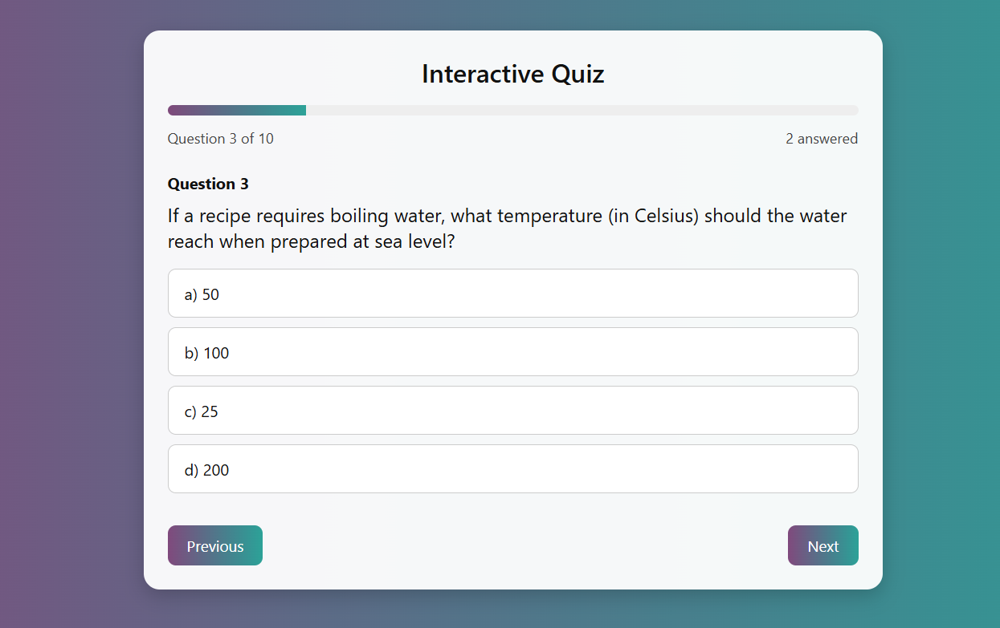
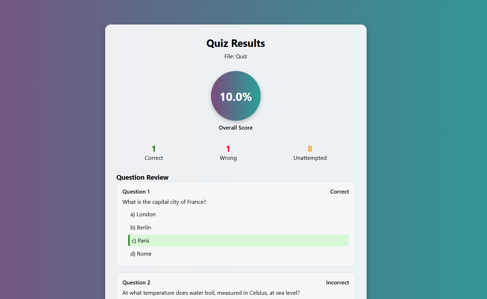
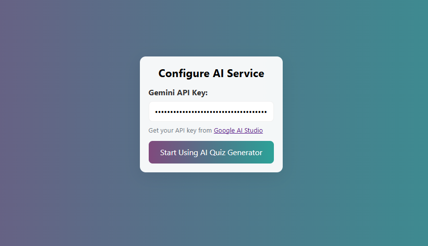

# Quiz Generator

A React-based web application that allows users to upload PDF or DOCX files containing multiple-choice questions (MCQs) and automatically converts them into an interactive online quiz.

## 📋 About

This application extracts questions from uploaded documents, presents them in an interactive quiz format, and provides detailed results with performance metrics. It supports both PDF and DOCX file formats.

## ⚠️ License & Usage

**Copyright © 2023 Muhammad Zahooruddin Nizamani. All Rights Reserved.**

This software is proprietary and confidential. Unauthorized copying, distribution, or use of this software, via any medium, is strictly prohibited without prior written consent from the author.

**Permitted Use:**
- Personal educational purposes
- Non-commercial academic use

**Prohibited Use:**
- Commercial use of any kind
- Redistribution or modification without permission
- Incorporation into other projects without authorization

For licensing inquiries, please contact: zahooruddin.dev@gmail.com

## 🚀 Features

- 📄 PDF and DOCX file upload support
- 🧠 AI-powered question extraction (when API key provided)
- 📝 Interactive quiz interface
- 📊 Detailed results with performance metrics
- 🎨 Responsive design for mobile and desktop
- 🔧 Configurable API settings

## 🛠️ Installation

1. Clone the repository:
```bash
git clone https://github.com/zahooruddin-dev/quiz-generator.git
cd quiz-generator
📸 Screenshots

API Configuration Interface
quiz\src\assets\img\api.png

File Upload Interface
quiz\src\assets\img\fileupload.png

Interactive Quiz Interface
quiz\src\assets\img\quiz.png

Results and Performance Analysis
quiz\src\assets\img\results.png

quiz-generator/
├── src/
│   ├── components/
│   │   ├── FileUpload.jsx

│   │   ├── QuizEngine.jsx

│   │   ├── ResultPage.jsx

│   │   └── APIConfig.jsx

│   ├── utils/
│   │   └── formatMCQ.js
│   ├── App.jsx
│   └── App.css
├── LICENSE
└── README.md
🔧 Configuration
To use AI-powered features, you'll need to configure an API key in the settings panel. This is optional but enhances the question extraction capabilities.

📞 Support
For questions about this project, please contact:
Muhammad Zahooruddin Nizamani
mzkhan886@gmail.com
Copyright © 2025 Muhammad Zahooruddin Nizamani. All Rights Reserved.

## Instructions for Adding Screenshots

1. Create a folder named `screenshots` in your project root
2. Add your screenshot images to this folder
3. Update the image filenames in the README.md to match your actual screenshot files

This licensing approach protects your intellectual property while allowing for educational use. The README provides clear information about the project while emphasizing your copyright ownership.